# Jarkom-Modul-3-E06-2023
Berikut adalah repository dari kelompok E06 untuk pengerjaan Praktikum Modul 3 Jaringan Komputer. Repository ini akan berisikan dokumentasi cara pengerjaan tiap soal, screenshot output, dan kendala yang dialami.

# Anggota Kelompok
| Nama | NRP | 
| --- | --- |
| Muhammad Hafidh Rosyadi | 5025211013 |
| Kartika Diva Asmara Gita | 5025211039 |

# Dokumentasi Pengerjaan Soal
## Bagian 1
Setelah mengalahkan Demon King, perjalanan berlanjut. Kali ini, kalian diminta untuk melakukan register domain berupa riegel.canyon.yyy.com untuk worker Laravel dan granz.channel.yyy.com untuk worker PHP **(0)** mengarah pada worker yang memiliki IP [prefix IP].x.1.

**(1)** Lakukan konfigurasi sesuai dengan peta yang sudah diberikan.

Kemudian, karena masih banyak spell yang harus dikumpulkan, bantulah para petualang untuk memenuhi kriteria berikut.:
Semua CLIENT harus menggunakan konfigurasi dari DHCP Server.

Client yang melalui Switch3 mendapatkan range IP dari [prefix IP].3.16 - [prefix IP].3.32 dan [prefix IP].3.64 - [prefix IP].3.80 **(2)**

Client yang melalui Switch4 mendapatkan range IP dari [prefix IP].4.12 - [prefix IP].4.20 dan [prefix IP].4.160 - [prefix IP].4.168 **(3)**

Client mendapatkan DNS dari Heiter dan dapat terhubung dengan internet melalui DNS tersebut **(4)**

Lama waktu DHCP server meminjamkan alamat IP kepada Client yang melalui Switch3 selama 3 menit sedangkan pada client yang melalui Switch4 selama 12 menit. Dengan waktu maksimal dialokasikan untuk peminjaman alamat IP selama 96 menit **(5)**

#### Topologi (1)


#### Konfigurasi  
- Aura 
```
# DHCP config for eth0
auto eth0
iface eth0 inet dhcp

# Static config for eth1
auto eth1
iface eth1 inet static
	address 192.209.1.1
	netmask 255.255.255.0

# Static config for eth2
auto eth2
iface eth2 inet static
	address 192.209.2.1
	netmask 255.255.255.0

# Static config for eth3
auto eth3
iface eth3 inet static
	address 192.209.3.4
	netmask 255.255.255.0

# Static config for eth4
auto eth4
iface eth4 inet static
	address 192.209.4.4
	netmask 255.255.255.0
```

- Himmel / DHCP Server
```
auto eth0
iface eth0 inet static
	address 192.209.1.2
	netmask 255.255.255.0
	gateway 192.209.1.1
```

- Heiter / DNS Server
```
auto eth0
iface eth0 inet static
	address 192.209.1.3
	netmask 255.255.255.0
	gateway 192.209.1.1
```

- Denken
```
auto eth0
iface eth0 inet static
	address 192.209.2.2
	netmask 255.255.255.0
	gateway 192.209.2.1
```

- Eisen
```
auto eth0
iface eth0 inet static
	address 192.209.2.3
	netmask 255.255.255.0
	gateway 192.209.2.1
```

- Lawine
```
auto eth0
iface eth0 inet dhcp
hwaddress ether 8a:d5:50:e4:b5:66
```

- Linie
```
auto eth0
iface eth0 inet dhcp
hwaddress ether 92:2a:32:38:62:fe
```

- Lugner
```
auto eth0
iface eth0 inet dhcp
hwaddress ether c2:21:bb:45:de:b9
```

- Frieren
```
auto eth0
iface eth0 inet dhcp
hwaddress ether 96:b8:1f:4e:bf:fb
```

- Flamme
```
auto eth0
iface eth0 inet dhcp
hwaddress ether d2:59:48:28:a2:d4
```

- Fern
```
auto eth0
iface eth0 inet dhcp
hwaddress ether 86:ec:9f:90:81:6d
```

- Client
```
auto eth0
iface eth0 inet dhcp
```

#### Setting pada Himmel/DHCP Server
```
apt-get update
apt-get install isc-dhcp-server -y

a='INTERFACESv4="eth0"
INTERFACESv6=""'

echo "$a" > /etc/default/isc-dhcp-server


config='ddns-update-style none;
option domain-name "example.org";
option domain-name-servers ns1.example.org, ns2.example.org;

default-lease-time 600;
max-lease-time 7200;

authoritative;
log-facility local7;

subnet 192.209.1.0 netmask 255.255.255.0 {
  option routers 192.209.1.1;
}

subnet 192.209.2.0 netmask 255.255.255.0 {
  option routers 192.209.2.1;
}

subnet 192.209.3.0 netmask 255.255.255.0 {
    # (2)
    range 192.209.3.16 192.209.3.32;
    range 192.209.3.64 192.209.3.80;
    option routers 192.209.3.4;
    option broadcast-address 192.209.3.255;
    option domain-name-servers 192.209.1.3;
    # (5)
    default-lease-time 180;
    max-lease-time 5760;
}

subnet 192.209.4.0 netmask 255.255.255.0 {
    # (3)
    range 192.209.4.12 192.209.4.20;
    range 192.209.4.160 192.209.4.168;
    option routers 192.209.4.4;
    option broadcast-address 192.209.4.255;
    option domain-name-servers 192.209.1.3;
    # (5)
    default-lease-time 720;
    max-lease-time 5760;
}

host Lawine {
    hardware ethernet 8a:d5:50:e4:b5:66;
    fixed-address 192.209.3.1;
}

host Linie {
    hardware ethernet 92:2a:32:38:62:fe;
    fixed-address 192.209.3.2;
}

host Lugner {
    hardware ethernet c2:21:bb:45:de:b9;
    fixed-address 192.209.3.3;
}

host Frieren {
    hardware ethernet 96:b8:1f:4e:bf:fb;
    fixed-address 192.209.4.1;
}

host Flamme {
    hardware ethernet d2:59:48:28:a2:d4;
    fixed-address 192.209.4.2;
}

host Fern {
    hardware ethernet 86:ec:9f:90:81:6d;
    fixed-address 192.209.4.3;
}'


echo "$config" > /etc/dhcp/dhcpd.conf

rm /var/run/dhcpd.pid

service isc-dhcp-server restart
```

#### Setting DHCP Relay aura

```
apt-get update
apt-get install isc-dhcp-relay -y
service isc-dhcp-relay start


a='SERVERS="192.209.1.2"
INTERFACES="eth1 eth2 eth3 eth4"
OPTIONS='

echo "$a" > /etc/default/isc-dhcp-relay

b='net.ipv4.ip_forward=1'

echo "$b" > /etc/sysctl.conf

service isc-dhcp-relay restart
```
#### Setting DNS pada DNS server heiter
```
apt-get update
apt-get install bind9 -y

mkdir /etc/bind/granz
mkdir /etc/bind/riegel
# (0)
a='zone "granz.channel.E06.com" {
    type master;
    file "/etc/bind/granz/granz.channel.E06.com";
};

zone "riegel.canyon.E06.com" {
    type master;
    file "/etc/bind/riegel/riegel.canyon.E06.com";
};'

echo "$a" > /etc/bind/named.conf.local


b=';
; BIND data file for local loopback interface
;
$TTL    604800
@       IN      SOA     riegel.canyon.E06.com. root.riegel.canyon.E06.com. (
                              2         ; Serial
                         604800         ; Refresh
                          86400         ; Retry
                        2419200         ; Expire
                         604800 )       ; Negative Cache TTL
;
@           IN      NS      riegel.canyon.E06.com.
@           IN      A       192.209.4.1 ; IP Frieren
www         IN      CNAME   riegel.canyon.E06.com.'

echo "$b" > /etc/bind/riegel/riegel.canyon.E06.com


c=';
; BIND data file for local loopback interface
;
$TTL    604800
@       IN      SOA     granz.channel.E06.com. root.granz.channel.E06.com. (
                              2         ; Serial
                         604800         ; Refresh
                          86400         ; Retry
                        2419200         ; Expire
                         604800 )       ; Negative Cache TTL
;
@           IN      NS      granz.channel.E06.com.
@           IN      A       192.209.3.1 ; IP Lawine
www         IN      CNAME   granz.channel.E06.com.'

echo "$c" > /etc/bind/granz/granz.channel.E06.com
# (4)
d='options {
        directory "/var/cache/bind";

        forwarders {
                192.168.122.1;
        };
        allow-query{any;};

        //dnssec-validation auto;

        listen-on-v6 { any; };
};'

echo "$d" > /etc/bind/named.conf.options
service bind9 restart
```

#### ping testing pada client


## Bagian 1
Berjalannya waktu, petualang diminta untuk melakukan deployment.
1. Pada masing-masing worker PHP, lakukan konfigurasi virtual host untuk website berikut dengan menggunakan php 7.3. (6)
2. Kepala suku dari Bredt Region memberikan resource server sebagai berikut:
Lawine, 4GB, 2vCPU, dan 80 GB SSD.
Linie, 2GB, 2vCPU, dan 50 GB SSD.
Lugner 1GB, 1vCPU, dan 25 GB SSD.
aturlah agar Eisen dapat bekerja dengan maksimal, lalu lakukan testing dengan 1000 request dan 100 request/second. (7)
3. Karena diminta untuk menuliskan grimoire, buatlah analisis hasil testing dengan 200 request dan 10 request/second masing-masing algoritma Load Balancer dengan ketentuan sebagai berikut:
- Nama Algoritma Load Balancer
- Report hasil testing pada Apache Benchmark
- Grafik request per second untuk masing masing algoritma. 
- Analisis (8)
4. Dengan menggunakan algoritma Round Robin, lakukan testing dengan menggunakan 3 worker, 2 worker, dan 1 worker sebanyak 100 request dengan 10 request/second, kemudian tambahkan grafiknya pada grimoire. (9)
5. Selanjutnya coba tambahkan konfigurasi autentikasi di LB dengan dengan kombinasi username: “netics” dan password: “ajkyyy”, dengan yyy merupakan kode kelompok. Terakhir simpan file “htpasswd” nya di /etc/nginx/rahasisakita/ (10)
6. Lalu buat untuk setiap request yang mengandung /its akan di proxy passing menuju halaman https://www.its.ac.id. (11) hint: (proxy_pass)
7. Selanjutnya LB ini hanya boleh diakses oleh client dengan IP [Prefix IP].3.69, [Prefix IP].3.70, [Prefix IP].4.167, dan [Prefix IP].4.168. (12) hint: (fixed in dulu clinetnya)


#### (6) pada setiap php worker (Lawine, Linie, Lugner) setting sebagai berikut untuk deployment
```
apt-get update && apt install nginx php php-fpm -y git
git config --global http.sslVerify false
git clone https://github.com/Hfdrsyd/Jarkom-Modul-3-E06-2023.git

mkdir /var/www/granz
cp -r /Jarkom-Modul-3-E06-2023/granz.channel.yyy.com/modul-3 /var/www/granz

gg='server {

        listen 80;

        root /var/www/granz/modul-3;

        index index.php index.html index.htm;
        server_name _;

        location / {
                        try_files $uri $uri/ /index.php?$query_string;
        }

        # pass PHP scripts to FastCGI server
        location ~ \.php$ {
        include snippets/fastcgi-php.conf;
        fastcgi_pass unix:/var/run/php/php7.3-fpm.sock;
        }

        location ~ /\.ht {
                        deny all;
        }

        error_log /var/log/nginx/jarkom_error.log;
        access_log /var/log/nginx/jarkom_access.log;
 }'


echo "$gg" > /etc/nginx/sites-available/jarkom

rm -rf /etc/nginx/sites-enabled/default
ln -s /etc/nginx/sites-available/jarkom /etc/nginx/sites-enabled
service php7.3-fpm start
service nginx restart
```

Berikut lynx pada salah satu worker (Linie) di client

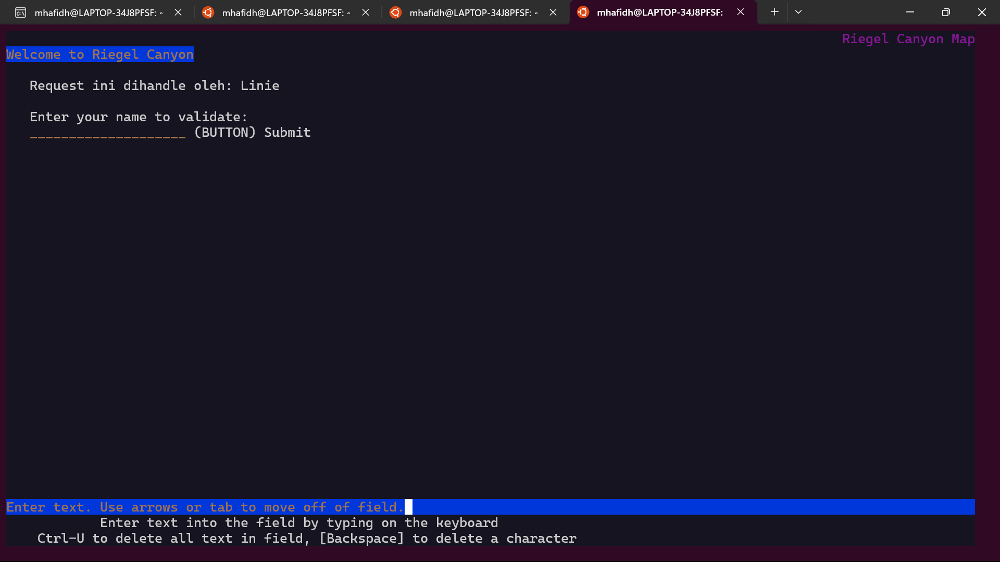

#### (7) lakukan setting pada load balancer (Eisen)
setting dilakukan menggunakan algoritma Round Robin namun menggunakan weight sehingga dapat seolah-olah merepresentasikan resource server.
```
apt-get update
apt-get install apache2-utils -y

mkdir -p /etc/nginx/rahasisakita
htpasswd -cb /etc/nginx/rahasisakita/htpasswd netics ajkE06

ff='apt-get update
apt-get install bind9 nginx -y

ff='
upstream granz  {
        server 192.209.3.1 weight=4;
        server 192.209.3.2 weight=2;
        server 192.209.3.3 weight=1;
}
upstream riegel  {
        server 192.209.4.1;
        server 192.209.4.2;
        server 192.209.4.3;
}

 server {
        listen 80;
        server_name _;

        location / {
        proxy_pass http://granz;
        }
 }
server {
        listen 80;
        server_name _;

        location / {
        proxy_pass http://riegel;
        }
 }

'

echo "$ff" > /etc/nginx/sites-available/lb-switch3
unlink /etc/nginx/sites-enabled/default
ln -s /etc/nginx/sites-available/lb-switch3 /etc/nginx/sites-enabled/lb-switch3'
unlink /etc/nginx/sites-enabled/default
echo "$ff" > /etc/nginx/sites-available/lb-switch4
ln -sf /etc/nginx/sites-available/lb-switch4 /etc/nginx/sites-enabled/lb-switch4
```


#### testing dengan 1000 request dan 100 request/second.
```
ab -n 1000 -c 100 -g out.txt http://192.209.2.3/
```
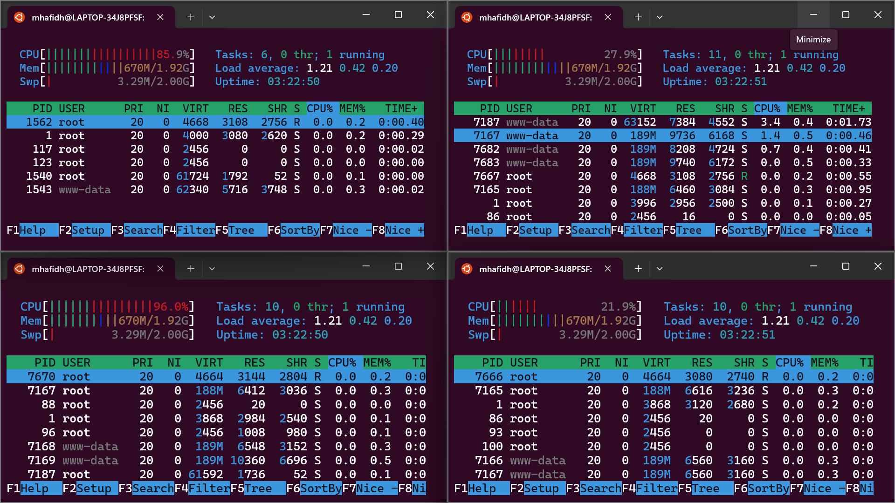

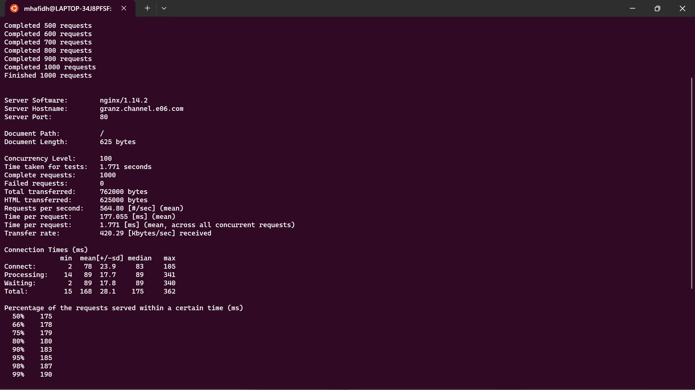

### (8) dan (9)
### nomer 8
#### Round Robin
```
upstream granz  {
        server 192.209.3.1;
        server 192.209.3.2;
        server 192.209.3.3;
 }
```
#### Weighted Round Robin
```
upstream granz  {
        server 192.209.3.1 weight=4;
        server 192.209.3.2 weight=2;
        server 192.209.3.3 weight=1;
}
```

#### Least Connection
```
upstream granz  {
        least_conn;
        server 192.209.3.1;
        server 192.209.3.2;
        server 192.209.3.3;
}
```
#### IP Hash
```
upstream granz  {
        ip_hash;
        server 192.209.3.1;
        server 192.209.3.2;
        server 192.209.3.3;
}
```
#### Generic IP Hash
```
upstream granz  {
        hash $request_uri consistent;
        server 192.209.3.1;
        server 192.209.3.2;
        server 192.209.3.3;
}
```
### nomer 9 dapat dilakukan dengan mengurangi satu persatu ip server yang terhubung ke stream.
```
upstream granz  {
        server 192.209.3.1;
        server 192.209.3.2;
        server 192.209.3.3;
 }
```

#### <a href="https://docs.google.com/document/d/1YD0pExQ0IW7_EknqfYw6FCfXo7eCfq0nbOAaxD0O1EU/edit?usp=sharing">Silahkan buka Grimore disini untuk melihat hasil </a> 

#### (10), (11), dan (12) 
- autentikasi di LB dengan dengan kombinasi username: “netics” dan password: “ajkyyy”
- setiap request yang mengandung /its akan di proxy passing menuju halaman https://www.its.ac.id
- LB ini hanya boleh diakses oleh client dengan IP [Prefix IP].3.69, [Prefix IP].3.70, [Prefix IP].4.167, dan [Prefix IP].4.168. (12)
berikut konfigurasi dari lb nya:
```
apt-get update
apt-get install apache2-utils -y

mkdir -p /etc/nginx/rahasisakita
htpasswd -cb /etc/nginx/rahasisakita/htpasswd netics ajkE06

ff='upstream granz{
    server 192.209.3.1;
    server 192.209.3.2;
    server 192.209.3.3;
}

upstream riegel{
    server 192.209.4.1;
    server 192.209.4.2;
    server 192.209.4.3;
}

server {
    listen 81;
    server_name _; # Change to your actual domain

    location / {
        allow 192.209.3.69;
        allow 192.209.3.70;
        allow 192.209.4.167;
        allow 192.209.4.168;
        deny all;
        auth_basic "Restricted Content";
        auth_basic_user_file /etc/nginx/rahasisakita/htpasswd;
        proxy_pass http://granz;
    }
    location ~* /*its {
        proxy_pass https://www.its.ac.id;
    }
}

server {
    listen 80;
    server_name _; # Change to your Laravel domain

    location / {
        proxy_pass http://riegel;
    }
    location ~* /*its {
        proxy_pass https://www.its.ac.id;
    }
}'
echo "$ff" > /etc/nginx/sites-available/lb-switch3
service nginx restart
```
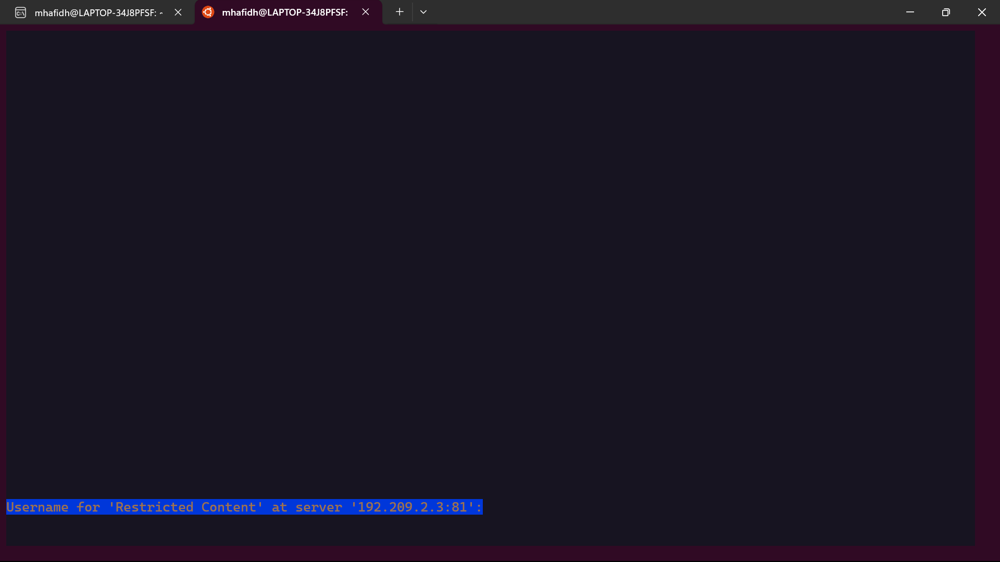

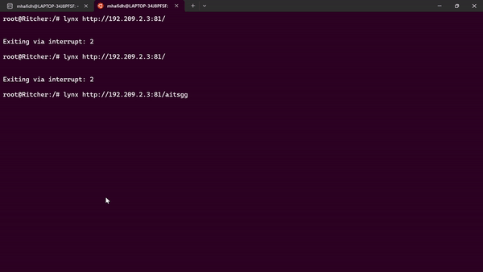

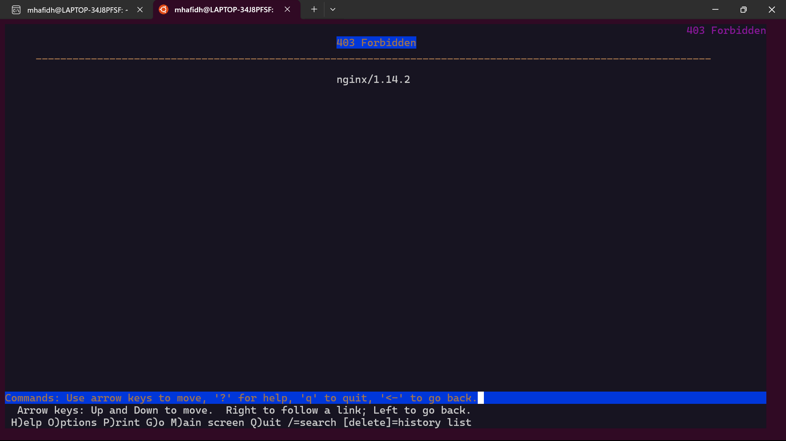
## Bagian 3
1. Semua data yang diperlukan, diatur pada Denken dan harus dapat diakses oleh Frieren, Flamme, dan Fern. (13)
2. Frieren, Flamme, dan Fern memiliki Riegel Channel sesuai dengan quest guide berikut. Jangan lupa melakukan instalasi PHP8.0 dan Composer (14)
3. Riegel Channel memiliki beberapa endpoint yang harus ditesting sebanyak 100 request dengan 10 request/second. Tambahkan response dan hasil testing pada grimoire.
- POST /auth/register (15)
- POST /auth/login (16)
- GET /me (17)
4. Untuk memastikan ketiganya bekerja sama secara adil untuk mengatur Riegel Channel maka implementasikan Proxy Bind pada Eisen untuk mengaitkan IP dari Frieren, Flamme, dan Fern. (18)
5. Untuk meningkatkan performa dari Worker, coba implementasikan PHP-FPM pada Frieren, Flamme, dan Fern. Untuk testing kinerja naikkan 
- pm.max_children
- pm.start_servers
- pm.min_spare_servers
- pm.max_spare_servers
sebanyak tiga percobaan dan lakukan testing sebanyak 100 request dengan 10 request/second kemudian berikan hasil analisisnya pada Grimoire.(19)
5. Nampaknya hanya menggunakan PHP-FPM tidak cukup untuk meningkatkan performa dari worker maka implementasikan Least-Conn pada Eisen. Untuk testing kinerja dari worker tersebut dilakukan sebanyak 100 request dengan 10 request/second. (20)

### 1. Semua data yang diperlukan, diatur pada Denken dan harus dapat diakses oleh Frieren, Flamme, dan Fern. (13)
konfigurasi database server pada denken:
```
apt-get update
apt-get install mariadb-server -y

a="CREATE USER 'kelompokE06'@'%' IDENTIFIED BY 'pwE06';
CREATE USER 'kelompokE06'@'localhost' IDENTIFIED BY 'pwE06';
CREATE DATABASE dbkelompokE06;
GRANT ALL PRIVILEGES ON *.* TO 'kelompokE06'@'%';
GRANT ALL PRIVILEGES ON *.* TO 'kelompokE06'@'localhost';
FLUSH PRIVILEGES;"

echo "$a" > /root/query.sql

mysql < /root/query.sql

ff='[mysqld]
skip-networking=0
skip-bind-address'

echo "$ff" >> /etc/mysql/my.cnf
service mysql restart
```
kemudian install database client pada masing masing worker laravel.
```
apt-get update
apt-get install mariadb-client -y
```
Test apakah terhubung dengan:
```
mariadb --host=192.209.2.2 --port=3306 --user=kelompokE06 --password
```
berikut screeshoot salah satu worker.

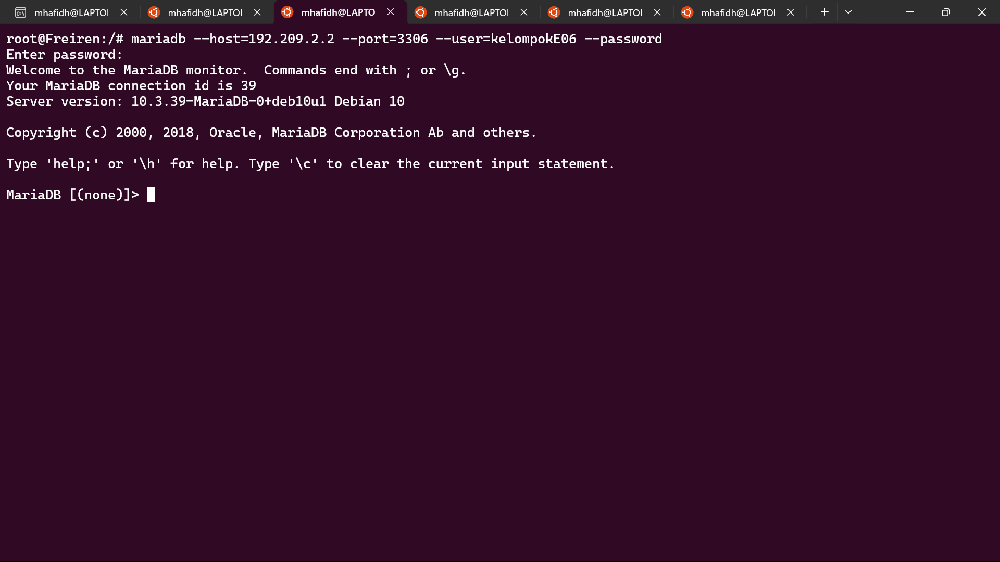

### 2. Frieren, Flamme, dan Fern memiliki Riegel Channel sesuai dengan quest guide berikut. Jangan lupa melakukan instalasi PHP8.0 dan Composer (14)
berikut configurasi untuk deployment pada masing masing worker:
```
apt-get update

apt-get install -y lsb-release ca-certificates apt-transport-https software-properties-common gnupg2

curl -sSLo /usr/share/keyrings/deb.sury.org-php.gpg https://packages.sury.org/php/apt.gpg

sh -c 'echo "deb [signed-by=/usr/share/keyrings/deb.sury.org-php.gpg] https://packages.sury.org/php/ $(lsb_release -sc) main" > /etc/apt/sources.list.d/php.list'
apt-get update

apt-get install php8.0-mbstring php8.0-xml php8.0-cli php8.0-common php8.0-intl php8.0-opcache php8.0-readline php8.0-mysql php8.0-fpm php8.0-curl unzip wget -y

apt-get install nginx -y

wget https://getcomposer.org/download/2.0.13/composer.phar
chmod +x composer.phar
mv composer.phar /usr/bin/composer

apt-get install git -y

cd /var/www
git clone https://github.com/martuafernando/laravel-praktikum-jarkom.git
cd /var/www/laravel-praktikum-jarkom
composer update


b='
APP_NAME=Laravel
APP_ENV=local
APP_KEY=
APP_DEBUG=true
APP_URL=http://localhost

LOG_CHANNEL=stack
LOG_DEPRECATIONS_CHANNEL=null
LOG_LEVEL=debug

DB_CONNECTION=mysql
DB_HOST=192.209.2.2
DB_PORT=3306
DB_DATABASE=dbkelompokE06
DB_USERNAME=kelompokE06
DB_PASSWORD=pwE06

BROADCAST_DRIVER=log
CACHE_DRIVER=file
FILESYSTEM_DISK=local
QUEUE_CONNECTION=sync
SESSION_DRIVER=file
SESSION_LIFETIME=120

MEMCACHED_HOST=127.0.0.1

REDIS_HOST=127.0.0.1
REDIS_PASSWORD=null
REDIS_PORT=6379

MAIL_MAILER=smtp
MAIL_HOST=mailpit
MAIL_PORT=1025
MAIL_USERNAME=null
MAIL_PASSWORD=null
MAIL_ENCRYPTION=null
MAIL_FROM_ADDRESS="hello@example.com"
MAIL_FROM_NAME="${APP_NAME}"

AWS_ACCESS_KEY_ID=
AWS_SECRET_ACCESS_KEY=
AWS_DEFAULT_REGION=us-east-1
AWS_BUCKET=
AWS_USE_PATH_STYLE_ENDPOINT=false

PUSHER_APP_ID=
PUSHER_APP_KEY=
PUSHER_APP_SECRET=
PUSHER_HOST=
PUSHER_PORT=443
PUSHER_SCHEME=https
PUSHER_APP_CLUSTER=mt1

VITE_PUSHER_APP_KEY="${PUSHER_APP_KEY}"
VITE_PUSHER_HOST="${PUSHER_HOST}"
VITE_PUSHER_PORT="${PUSHER_PORT}"
VITE_PUSHER_SCHEME="${PUSHER_SCHEME}"
VITE_PUSHER_APP_CLUSTER="${PUSHER_APP_CLUSTER}"
'

echo "$b" > ./.env

php artisan migrate:fresh
php artisan db:seed --class=AiringsTableSeeder

php artisan key:generate


c='server {

    listen 80;

    root /var/www/laravel-praktikum-jarkom/public;

    index index.php index.html index.htm;
    server_name _;

    location / {
            try_files $uri $uri/ /index.php?$query_string;
    }

    # pass PHP scripts to FastCGI server
    location ~ \.php$ {
    include snippets/fastcgi-php.conf;
    fastcgi_pass unix:/var/run/php/php8.0-fpm.sock;
    }

location ~ /\.ht {
            deny all;
    }

    error_log /var/log/nginx/implementasi_error.log;
    access_log /var/log/nginx/implementasi_access.log;
}'

echo "$c" > /etc/nginx/sites-available/implementasi
unlink /etc/nginx/sites-enabled/default
ln -s /etc/nginx/sites-available/implementasi /etc/nginx/sites-enabled/

chown -R www-data.www-data /var/www/laravel-praktikum-jarkom/storage
service nginx restart
service php8.0-fpm start
php artisan jwt:secret
```
kemudian lakukan setting di lb.

```
ff='upstream granz{
    server 192.209.3.1;
    server 192.209.3.2;
    server 192.209.3.3;
}

upstream riegel{
    server 192.209.4.1;
    server 192.209.4.2;
    server 192.209.4.3;
}

server {
    listen 81;
    server_name _; # Change to your actual domain

    location / {
        allow 192.209.3.69;
        allow 192.209.3.70;
        allow 192.209.4.167;
        allow 192.209.4.168;
        deny all;
        auth_basic "Restricted Content";
        auth_basic_user_file /etc/nginx/rahasisakita/htpasswd;
        proxy_pass http://granz;
    }
    location ~* /*its {
        proxy_pass https://www.its.ac.id;
    }
}

server {
    listen 80;
    server_name _; # Change to your Laravel domain

    location / {
        proxy_pass http://riegel;
    }
    location ~* /*its {
        proxy_pass https://www.its.ac.id;
    }
}'
echo "$ff" > /etc/nginx/sites-available/lb-switch3
service nginx restart
```

### (15), (16), (17) melakukan register, login, /me
berikut hasil testing
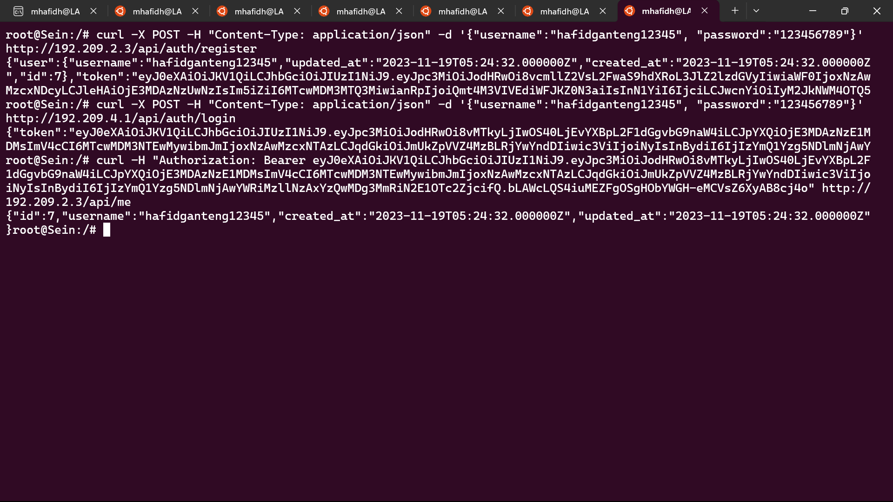

#### /register
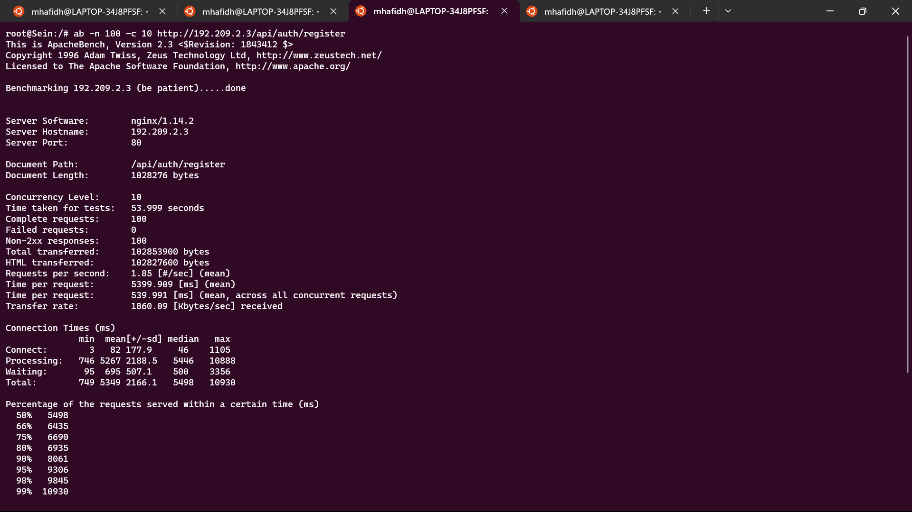

#### /login
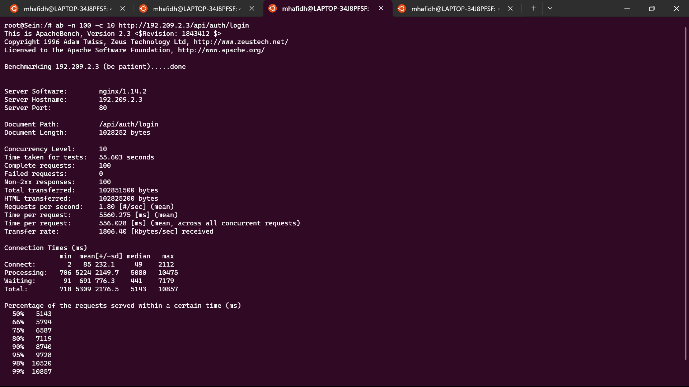

#### /me
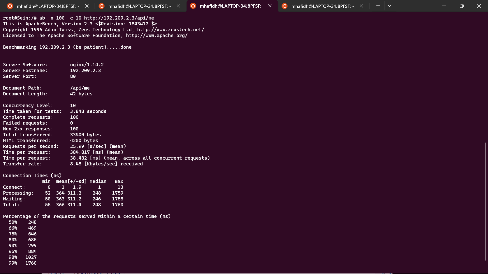

### (18) melakukan proxy bind
```
ff='upstream granz{
    server 192.209.3.1;
    server 192.209.3.2;
    server 192.209.3.3;
}

upstream riegel{
    server 192.209.4.1;
    server 192.209.4.2;
    server 192.209.4.3;
}

server {
    listen 81;
    server_name _; # Change to your actual domain

    location / {
        allow 192.209.3.69;
        allow 192.209.3.70;
        allow 192.209.4.167;
        allow 192.209.4.168;
        deny all;
        auth_basic "Restricted Content";
        auth_basic_user_file /etc/nginx/rahasisakita/htpasswd;
        proxy_pass http://granz;
    }
    location ~* /*its {
        proxy_pass https://www.its.ac.id;
    }
}

server {
    listen 80;
    server_name _; # Change to your Laravel domain

    location / {
        proxy_pass http://riegel;
    }
    location ~* /*its {
        proxy_pass https://www.its.ac.id;
    }
    location /frieren/ {
        proxy_bind 192.209.2.2;
        proxy_pass http://192.209.4.1/index.php;
    }

    location /flamme/ {
        proxy_bind 192.209.2.2;
        proxy_pass http://192.209.4.2/index.php;
    }

    location /fern/ {
        proxy_bind 192.209.2.2;
        proxy_pass http://192.209.4.3/index.php;
    }
}'
echo "$ff" > /etc/nginx/sites-available/lb-switch3
ln -sf /etc/nginx/sites-available/lb-switch3 /etc/nginx/sites-enabled/lb-switch3
service nginx restart
```

```
lynx http://192.209.2.3/frieren
```
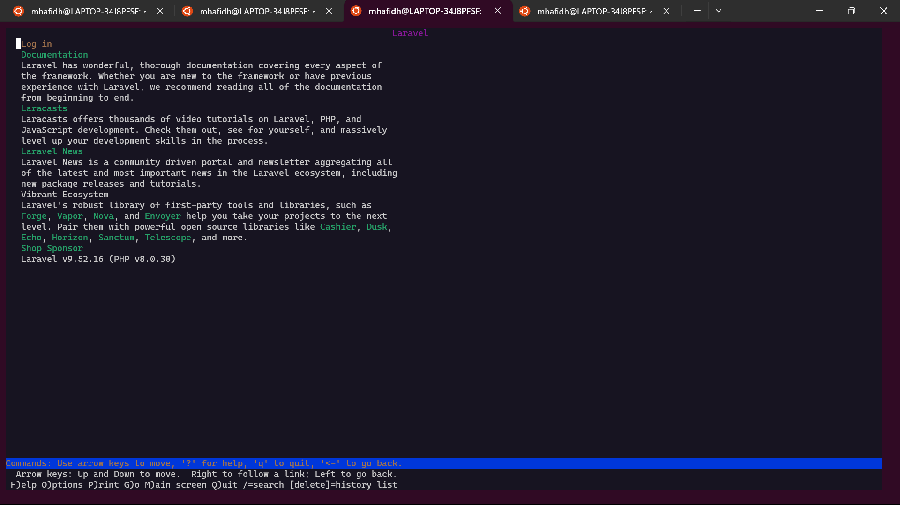

### (19)
